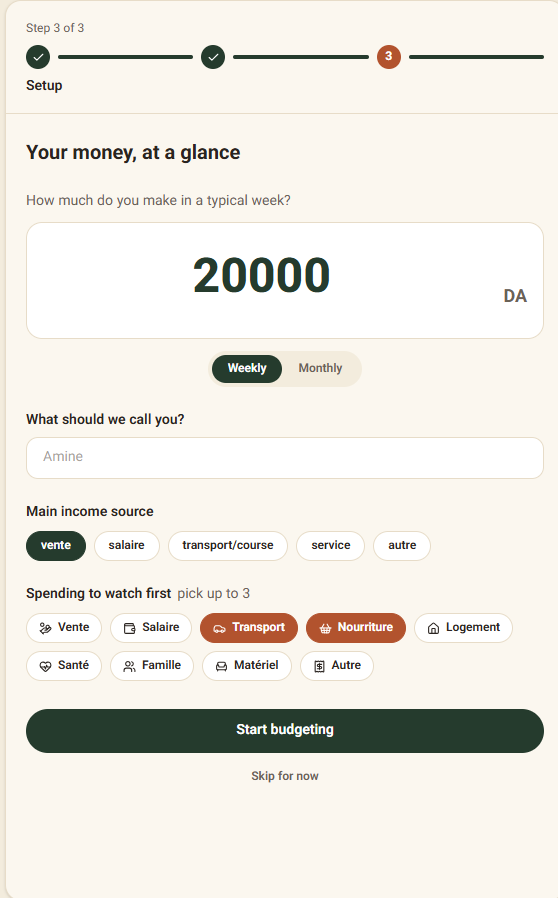
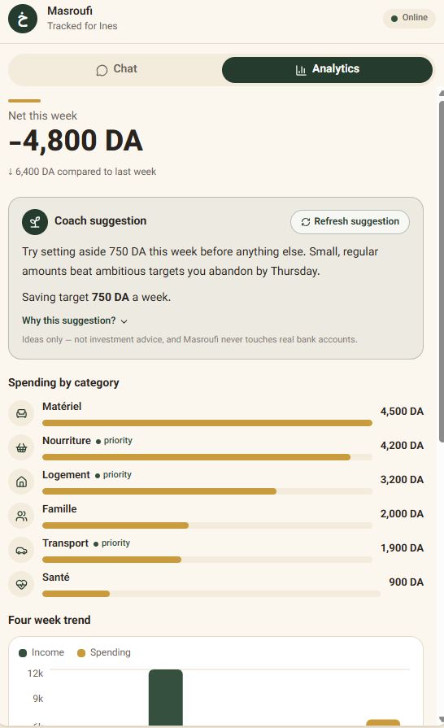
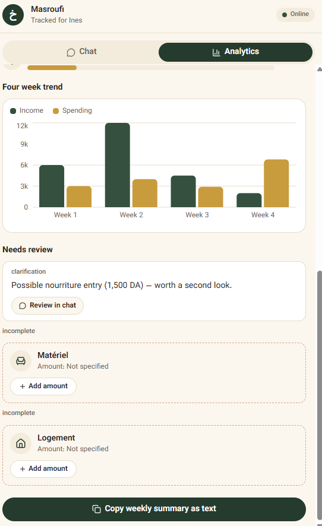
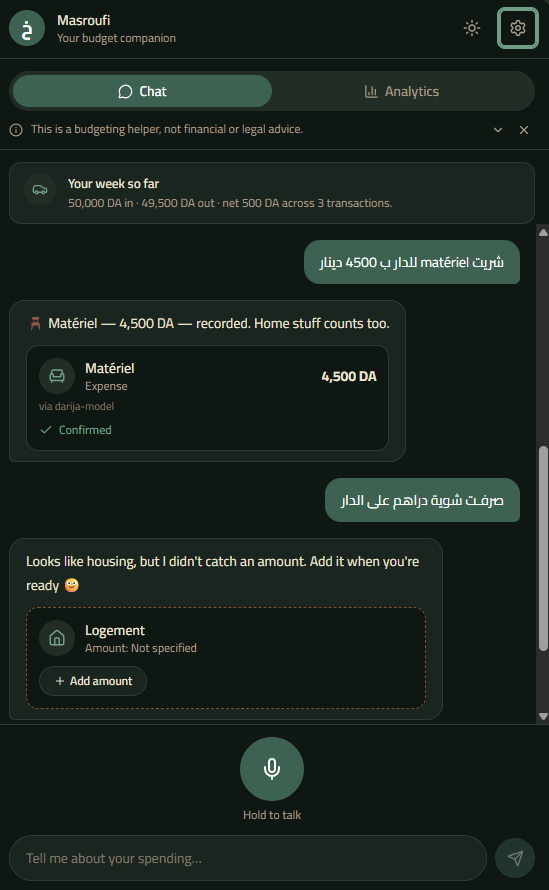
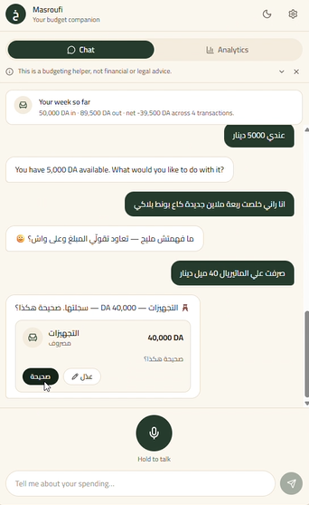

# Masroufi

### A voice-first personal finance assistant for Algerian Darija

Masroufi lets users record financial transactions the way they actually speak — in
Algerian Darija, often mixed with French — instead of filling out a form. Speech is
transcribed, converted into structured transaction data, validated by a deterministic
rules layer, and reflected immediately in a running financial summary.

Built for the "Come Build with AI" hackathon (GOMYCODE x NVIDIA), targeting the
**Guepard AI Automation Award** — best AI-powered workflow, agent, or automation with
clear productivity value.

---

## Problem

Standard expense-tracking apps require manual entry of transaction type, amount,
category, and description for every transaction. This is friction most people tolerate
poorly, and it is a particularly poor fit for a large population this category of
product usually ignores: cash-based, informal-economy workers in Algeria — market
vendors, drivers, tradespeople, freelancers — who think and speak about money in Darija,
not in the language these apps are built around.

A user naturally says something like:

> "هذ السمانة صرفت بزاف على الواي وعلى المصروف تاع الدار"

Masroufi's job is to take that sentence and turn it into a structured, reviewable
financial record, without asking the user to translate their own thinking into a form
first.



## Solution

Masroufi is a five-stage pipeline, not a single model call:

```
Voice input
    ↓
Local Algerian Darija ASR (Hadra ASR, Whisper Medium + LoRA adapter)
    ↓
Transcript
    ↓
LLM extraction (Groq, openai/gpt-oss-120b)
    ↓
Structured transaction candidate
    ↓
Deterministic validation layer (plain code, not AI)
    ↓
store / incomplete / clarification / discard
    ↓
Frontend: confirmation, transaction history, financial summary, AI suggestion
```
The deliberate separation between AI extraction and deterministic validation is the
core design decision in this project: the model proposes, the rules layer decides.
Numbers the user sees are never invented by the language model — they are validated,
normalized, and only stored once they clear explicit rules.

---

## Why this is genuinely agentic, not a chatbot wrapper

Each stage in the pipeline does a distinct job and hands off a distinct data shape to
the next: speech understanding, language extraction, validation, and presentation are
separable, independently testable stages. This is the shape the Guepard award asks
for — a multi-step automated workflow — rather than one prompt with an interface
around it.

---

## Speech recognition

**Model:** `algerian-nlp/Hadra-ASR-whisper-medium` — a LoRA adapter fine-tuned on
Algerian Darja speech, applied on top of `openai/whisper-medium`, run locally via
PyTorch with CUDA acceleration.

**Why local:** removes network dependency and external latency from the highest-traffic
part of the pipeline, and keeps raw speech data on the user's own machine rather than
sent to a third party by default.

**Honest performance note:** the adapter's published word-error-rate figures are
self-reported and, by the model authors' own documentation, unverified against an
independently reproducible test set — the true figures may not hold in general use. We
did not take this at face value. We ran our own test set of Darija/French-mixed
recordings and evaluated the actual output ourselves (see Testing, below) rather than
citing the headline number uncritically.

**Known limitation, disclosed rather than hidden:** the model's training data skews
toward Central and Western Algerian dialects; Eastern and Saharan accents may see more
variance. This was confirmed in our own testing and is treated as a documented
limitation, not a surprise discovered by a judge.

---
### Model architecture

The speech-recognition component is built as an adapted Whisper architecture rather than a model trained from scratch.

The structure is:

```text
Algerian Darja / Darija-French speech
                ↓
        Audio preprocessing
                ↓
        Whisper Medium
    `openai/whisper-medium`
                ↓
          LoRA adapter
                ↓
     Hadra ASR for Algerian Darja
                ↓
          Transcribed text
                ↓
     LLM transaction extraction
```

The base model, `openai/whisper-medium`, provides the general speech-recognition capability, while the **LoRA adapter** provides the specialization for Algerian Darja speech. This allows the project to adapt a pretrained speech model to the target dialect without training a complete ASR model from scratch.

The adapted model is loaded and executed locally using **PyTorch with CUDA acceleration**. The resulting transcript is then passed to the separate LLM extraction stage, which converts the recognized speech into structured financial information.

This separation is intentional: **the ASR model is responsible for speech-to-text, the LLM is responsible for interpreting the transcript, and the deterministic validation layer is responsible for deciding what can be stored.**

### Model-level testing results

The model was tested using real Darija and Darija/French-mixed recordings rather than relying only on the pretrained model's published benchmarks.

Representative outputs included successful recognition of expressions such as:

* `"راني حكمت 2000 رينار من عند الكليون هاد السمانة"`
* `"جيت ديپونسي 500 دينار سير لو ترسپور"`
* `"راني خلصت 15 ميل دينار علي الواي هذا الشهر"`

The tests also showed that the model can produce phonetic Arabic-script representations of French expressions, which the downstream extraction model can interpret from context.

On the local **NVIDIA RTX 2070 (8GB VRAM)**, transcription completed faster than the duration of every tested audio clip, with a measured real-time factor of approximately **0.3x–0.7x** and peak GPU memory usage of approximately **1.85GB**.

The tests also exposed an important limitation: because the underlying training data is more representative of Central and Western Algerian dialects, **Eastern and Saharan speech can show greater recognition variance**. This limitation is treated as part of the model's current scope rather than hidden from evaluation.

## Transaction extraction

**Model:** Groq-hosted `openai/gpt-oss-120b`.

Given a raw (and sometimes imperfect) transcript, the model returns a structured
candidate transaction:

```json
{
  "type": "expense",
  "amount": 15000,
  "currency": "DZD",
  "category": "logement",
  "confidence": "high",
  "original_text": "راني خلصت 15 ميل دينار علي الواي هذا الشهر"
}
```

The extraction prompt is explicitly instructed to reason about common ASR artifacts —
French words rendered phonetically in Arabic script (for example, "الواي" for "loyer",
"سبورت" for a transport-related word) — using context rather than a hardcoded lookup
table, so the system generalizes to phrasing it has not seen before rather than only to
the exact examples used during development.

The extraction layer also distinguishes between an actual transaction and a statement
about current possession. For example:

> "عندي 5000 دينار"

is correctly identified as informational, not automatically recorded as income.

---

## Deterministic validation

The language model's output is never trusted directly. A separate, plain-code
validation layer checks every extracted candidate before anything is stored, and
resolves to exactly one of four outcomes:

| Status | Meaning |
|---|---|
| `store` | Type, amount, and category are all sufficiently confident — saved directly. |
| `incomplete` | Recognized as a transaction, but a required field (usually amount) is missing — the user is asked to fill it in, nothing is guessed. |
| `clarification` | A possible transaction with low confidence — the user is asked to confirm before it is recorded. |
| `discard` | Not a financial transaction at all — nothing is stored. |

This is where the project's reliability claim actually lives: the system can say "I'm
not sure" and ask, rather than silently recording a wrong number.

---

## Testing

The pipeline was evaluated against a deliberately mixed test set — clean sentences,
Darija/French code-switching, an ambiguous statement, and a non-transaction — rather
than only the cases most likely to succeed.

Representative results:

| Input (transcribed) | Extraction result |
|---|---|
| "راني حكمت 2000 رينار من عند الكليون هاد السمانة" | Income, 2,000 DZD, `vente`, high confidence |
| "جيت ديپونسي 500 دينار سير لو ترسپور" | Expense, 500 DZD, `transport`, high confidence |
| "راني خلصت 15 ميل دينار علي الواي هذا الشهر" | Expense, 15,000 DZD, `logement`, high confidence |
| "صرفـت شوية دراهم على الدار" | `incomplete` — expense recognized, amount missing, correctly not guessed |
| "عندي 5000 دينار" | `discard` — correctly identified as informational, not an income event |

ASR performance was measured directly rather than assumed: on a local RTX 2070
(8GB VRAM), real-time factor ranged from roughly 0.3x to 0.7x (transcription completed
faster than the audio's own duration in every test clip), with peak GPU memory usage of
approximately 1.85GB — comfortable headroom for a live demonstration on modest consumer
hardware.

---

## Financial analytics
<p float="left">
  
  
</p>
The frontend derives its analytical views from validated transaction data returned by
the backend — total income, total expenses, net balance, category breakdown, a
multi-week trend, and a plain-language AI-generated suggestion for the week ahead. The
suggestion's numeric savings target is computed deterministically from the ledger, not
generated by the language model, for the same auditability reason as the validation
layer above.

---

## User experience

Masroufi is designed as a conversational, voice-first experience rather than a
traditional accounting interface. The core interaction is intentionally simple:

**Speak → Review → Confirm → Track**
<p float="left">
  
  
</p>

*Onboarding in light and dark mode.*
The interface includes conversational transaction entry, microphone recording,
transaction confirmation and editing, a lightweight onboarding/profile step, a financial
analytics view, AI-generated suggestions, and Darija/French-friendly content throughout,
with a responsive layout across phone, tablet, and desktop.

---

## Architecture

```
masroufi/
│
├── frontend/
│   ├── app/
│   ├── components/
│   ├── lib/
│   ├── package.json
│   └── ...
│
├── backend/
│   ├── api.py
│   ├── asr.py
│   ├── extraction.py
│   ├── pipeline.py
│   ├── validation.py
│   └── ...
│
├── .gitignore
└── README.md
```

---

## Technology stack

**Frontend:** Next.js, React, TypeScript, Tailwind CSS, Recharts

**Backend:** Python, FastAPI, PyTorch, Transformers, PEFT, librosa, NumPy, scikit-learn

**AI components:** Hadra ASR (Whisper Medium + LoRA), Groq (`openai/gpt-oss-120b`)

---

## Backend API

**Health check**
```
GET /
```
```json
{
  "name": "Algerian Financial Assistant",
  "status": "running"
}
```

**Process audio**
```
POST /process
```
Accepts an audio file. Returns the transcript, the extracted transaction candidate, and
the validation result (`store` / `incomplete` / `clarification` / `discard`).

**Financial summary**
```
GET /summary
```
```json
{
  "income": 0,
  "expense": 0,
  "net": 0,
  "transactions": []
}
```

---

## Responsible AI and data

- API keys are stored in environment variables and excluded from version control.
- User speech and text are never blindly converted into financial records — every
  AI-extracted candidate passes through the deterministic validation layer above before
  anything is stored.
- Low-confidence results require user clarification rather than being silently accepted.
- Non-transactional or invalid input is discarded rather than forced into a record.
- Financial information is treated as sensitive user data throughout the design.
- The assistant does not make investment decisions, recommend financial products, or
  claim to access real bank accounts — it is scoped to spending awareness and cash-flow
  habits only, and this boundary is stated explicitly in the extraction and suggestion
  prompts, not left implicit.
- Model limitations (ASR regional accuracy variance, self-reported and unverified
  benchmark figures) are disclosed rather than omitted.

---

## Prototype limitations

This is a hackathon prototype, and these limitations are stated directly rather than
implied by omission:

- ASR inference currently runs locally on the developer's machine, not on shared
  infrastructure.
- Transaction persistence is prototype-level (in-memory or lightweight local storage),
  not a production database.
- The category taxonomy is a fixed, limited set chosen for this prototype.
- Handling of a single utterance describing multiple distinct transactions is limited.
- Extraction depends on external LLM API availability (Groq).
- Deployment configuration is not yet finalized.

These are the explicit next steps, not hidden gaps.

---

## Running locally

**Backend**

```powershell
cd backend
```

Create and activate a Python environment, then install dependencies. Create
`backend/.env` with:

```env
GROQ_API_KEY=your_groq_api_key_here
```

Start the server:

```powershell
uvicorn api:app --reload
```

Available at `http://localhost:8000`.

**Frontend**

```powershell
cd frontend
```

Create `frontend/.env.local` with:

```env
NEXT_PUBLIC_API_URL=http://localhost:8000
```

Install and run:

```powershell
npm install
npm run dev
```

Available at `http://localhost:3000`.

Real API keys and local environment files must never be committed to the repository.

---

## Demo flow

1. Open Masroufi.
2. Start a voice recording.
3. Speak naturally in Algerian Darija.
4. Show the generated transcript.
5. Show the extracted transaction.
6. Confirm the transaction.
7. Open Analytics.
8. Show the updated financial overview.
9. Show the AI-generated suggestion.

The demonstration focuses on the complete path from natural speech to structured
financial insight, in under 90 seconds.

---

## Alignment with jury criteria

**Problem and user value:** a real, underserved population (informal-economy, Darija-
speaking users) ignored by existing budgeting products, grounded in direct domain
context rather than an invented persona.

**Functional execution:** a working, live pipeline — voice in, structured data out,
demonstrated end to end — not a slide concept.

**Quality of AI use:** a dialect-specific speech model paired with an LLM extraction
step and a deterministic validation layer, each doing a distinct, necessary job; ASR
behavior (phonetic French rendering, regional accuracy variance) was characterized
through direct testing rather than assumed from a vendor's claims.

**Testing and reliability:** a mixed test set covering clean, code-switched, ambiguous,
and non-transaction inputs, with real measured latency and memory figures, and explicit
routing for uncertain cases (`incomplete`, `clarification`) instead of silent guessing.

**Experience and demo:** a simple, understandable speak-review-confirm-track loop,
demonstrable in well under 90 seconds.

**Responsible AI and data:** explicit scope limits, disclosed model limitations, and a
hard separation between what the AI proposes and what the system actually stores.

---

## Fit with the Guepard AI Automation Award

Masroufi automates a genuine multi-step workflow — transcription, extraction,
validation, storage, and insight generation — replacing manual data entry with a
voice-first flow that produces a structured, auditable financial record. The
productivity value is concrete and specific: fewer manual fields to fill in, a lower
barrier to consistent tracking for users who would otherwise not track spending at all,
and a clear, deterministic boundary around what the AI is trusted to decide unassisted.

---

## Next steps

- Persistent user accounts and database-backed transaction storage
- Richer financial analytics
- Improved multi-transaction understanding in a single utterance
- Stronger Darija vocabulary coverage, particularly for Eastern/Saharan dialect variants
- Production deployment, authentication, and secure per-user data isolation
- Broader testing with real-world Algerian financial expressions

---

## Project status

Hackathon prototype, actively developed. The current repository contains the frontend
interface and the AI-powered backend pipeline required to demonstrate the core Masroufi
experience.

---

## License

Provided as a hackathon prototype.
